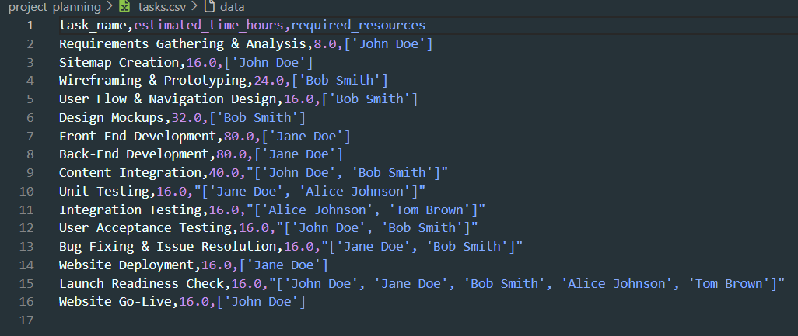
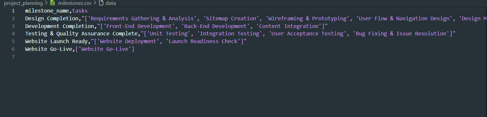

# Project Planner


## Overview
The Project Planner tool helps you efficiently plan, track, and manage your projects. By simply providing a description of your project, including goals, requirements, and team members, the tool generates a comprehensive plan with tasks, milestones, and team assignments. The result is a structured, organized project that you can easily follow and track.


## Features
### What This Project Does
This project streamlines project management by automating the creation of a detailed project plan. You can input the following information:

- Project Type

- Project Objectives

- Team Members

- Project Requirements

From this, the project will generate:

- *Tasks*: A list of actions, their details, and team assignments.

- *Milestones*: Key events or goals to track project progress.

#### Generated Output
After you provide the project description, the tool creates two CSV files:

`tasks.csv`
Contains task names, descriptions, assignees .... .



`milestones.csv`
Contains milestones with their details, deadlines, and responsible team members.



These files help keep track of each aspect of the project, from daily tasks to major milestones.

## Configuration and Personalization
The system uses a config file that contains task and agent configurations (e.g., team members, roles). You can easily personalize task details using Pydantic.

- Personalizing the task information will automatically update the generated CSV files.

- No need to manually modify the CSVs; the tool handles the changes based on your preferences.

### Requirements
To run this project, you need the following:

**Python** 3.11

**CrewAI**: For task and team management

**Groq**: For optimized and high-performance task execution
Groq Website

### How to Use 
**Install Dependencies**: 
First, install the necessary Python package:

`crewai` 

**Provide Project Description**: Enter the required project details:
```
Project Type

Objectives

Team Members

Requirements
```


**Generate Plan**: Once the project description is provided, the tool will generate:
```
Tasks in tasks.csv

Milestones in milestones.csv
```


**Personalize**:

Use the Pydantic configuration to customize task details and adjust team member assignments.

Any modifications in the config will automatically reflect in the output CSV files.

### Technology Stack
**Python 3.11**
**crewai**


**License**

This project is licensed under the MIT License – see the LICENSE file for details.

